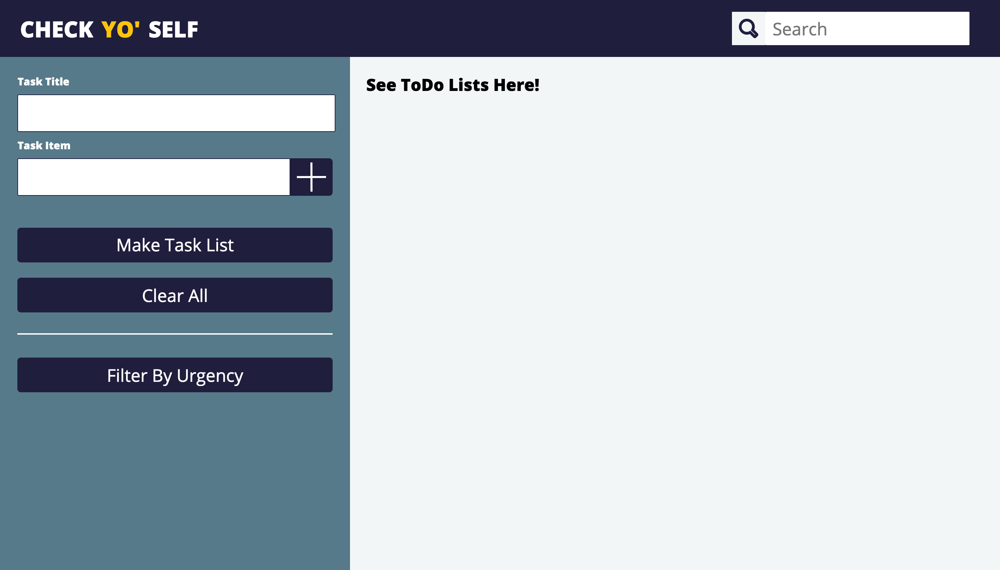
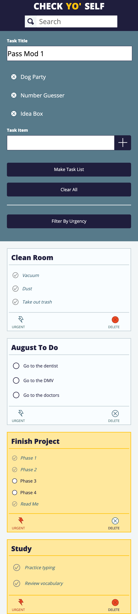

# Check Yo' Self Project

## General Info

A project for deeping my understanding of semantic HTML, clean & organized CSS styles, DRY Javascript, and localStorage to persist data in Turing's Front-End Engineering course, Module 1.
Repository can be found <a href="https://github.com/SamuelColeman/CheckYoSelf">here</a> and the project specs can be found <a href="https://frontend.turing.io/projects/check-yo-self.html">here</a>. The live page can be accessed <a href="https://samuelcoleman.github.io/CheckYoSelf/">here</a>.

## Contributors 

#### [Sam Coleman](https://github.com/SamuelColeman) 

## Motivation

Check Yo' Self is the final solo project I was assigned as a mod one student at Turing. I was given a page comp with certiain requirements to reproduce from scratch in code. This was completed by primarily working with JavaScript functionality and using HTML and CSS for the foundation and styling on the page.

## Built With

- HTML5
- CSS3
- JavaScript
- Blood, sweat, and tears

## Screenshots

## Features

- [x] Displaying multiple cards with multiple to do lists
- [x] Ability to delete any idea from the temp task list by pressing the 'x' on next to the task
- [x] Ability to clear all tasks from temp list and title input by pressing the clear all button
- [x] Persisting to do lists on page reload with persisting checks and urgent tags
- [x] Search function to sort ideas based on title of to do list
- [x] Urgent button on each card that persists on page load and changes the colors
- [x] Fully functioning mobile version 
- [ ] Ability to filter and display only urgent to do lists
- [ ] Ability to edit titles or tasks on the cards
- [ ] Drop down menu on the search funtion that allows you to search by title, task, or all

## How to Use

1. Enter a title for your to do list.

2. Enter some a task and press the plus button to add it to you temporary list. Add more.

3. Press the save button to create a card on the right side of the page with your new to do list.

4. Check off each task as you complete it and delete the card once you've finished all tasks.

5. Make as many cards at one time as you'd like!
